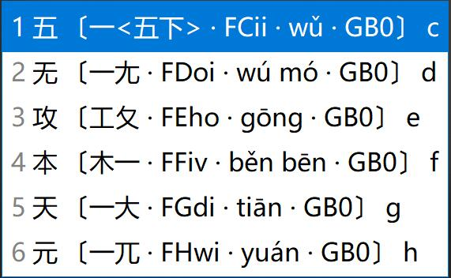

# RIME·宇浩输入法

[稳定版v1.4.3下载](https://github.com/forFudan/yuhao/releases) ·
[测试版下载（四重注解）](https://github.com/forFudan/yuhao/tree/main/beta/schema)

[官方网站](https://zhuyuhao.com/yuhao/) ·
[更新日志](https://zhuyuhao.com/yuhao/docs/updates/updates.html) ·
[详细教程](https://zhuyuhao.com/yuhao/docs/learn.html)
[拆分查询](https://zhuyuhao.com/yuhao/chaifen/)

[TOC]

## RIME 平台安装（小狼毫、鼠须管、同文、iRime、仓输入法）

下面介绍的是挂载于[RIME平台（小狼毫、鼠须管、同文、iRime）](https://rime.im/)的方案。我对它进行了深度定制，具有以下特点：

- 提供拆分、编码、字符集三重注解（Beta 版额外显示拼音，共四重注解）。
- 提供至 CJK-I 区、兼容区、部首区超过99000个汉字的完整拆分、编码提示、字集提示。
- 支持自定义字符集过滤生僻字。常用字约一万字，包括GB2312汉字、國語常用字、其它常用汉字等。支持用户自定义修改。
- 提供四码只出单字功能，适合单字派。
- 提供生僻字后置、生僻字屏蔽功能。

在安装了 Rime（小狼毫、鼠须管、同文、iRime）后，[在这个页面下载最新版本的 Rime 方案](https://github.com/forFudan/yuhao/releases)。 文件夹下的**所有文件**复制到**用户文件夹**下（可以右击 Rime 图标后点击「用户文件夹」来打开）。点击「部署」之后即可使用。

方案文件介绍：

- yuhao.schema.yaml 简化汉字优先方案，名为「开来学」。
- yuhao_tradition.schema.yaml 传统汉字大陆字形优先方案，名为「繼往聖」。
- yuhao_tradition_tw.schema.yaml 传统汉字台湾字形优先方案，名为「書同文」。
- yuhao.dict.yaml 简化字优先主码表。
- yuhao_tradition.dict.yaml 传统汉字优先主码表。
- yuhao.quick.dict.yaml 简化字简码码表。
- yuhao_tradition.quick.dict.yaml 传统汉字简码码表。
- yuhao_tradition_tw.quick.dict.yaml 传统汉字台湾字形简码码表。
- yuhao.full.dict.yaml 单字全码码表。
- yuhao.words 宇浩核心简体词库。约50000个词语，频率较高。
- yuhao.words_extended 宇浩增广简体词库。约30000个词语，频率较低，除非有特殊需求，否则不建议开启。
- yuhao.words_literature 宇浩成语诗词简体词库。约15000个成语和诗词，除非有特殊需求，否则不建议开启。
- yuhao_tradition.words 宇浩核心繁体词库，包括台湾、香港、大陆古籍繁体三种字形。约50000个词语，频率较高。
- yuhao_tradition.words_extended 宇浩增广繁体词库。约30000个词语，频率较低，除非有特殊需求，否则不建议开启。
- yuhao_tradition.words_literature 宇浩成语诗词繁体词库。约15000个成语和诗词，除非有特殊需求，否则不建议开启。
- yuhao.symbols.dict.yaml 特殊符号码表。
- yuhao_pinyin.schema.yaml 拼音配置文件，用于反查。
- yuhao_pinyin.dict.yaml 拼音字典文件。
- rime.lua 脚本设定。
- lua/yuhao/... 各种脚本。
- opencc/... 拆分表。

## RIME 平台特色功能介绍

<!-- omit in toc -->
### 提示快捷键
{: .no_toc }

输入`help`或`zzzz`或`bang`可显示快捷键提示。

<!-- omit in toc -->
### 单字拆分三重注解
{: .no_toc }

提供至 CJK-I 区、兼容区、部首区超过99000个汉字的拆分、编码提示、字集提示。拆分提示中包括三重注解：

1. 该汉字的拆分。
2. 该汉字的全码。使用大小写字母区分字根的大小码。
3. 该汉字所在的字符集（CJK，CJK-A 到 CJK-I 区，兼容字等）。

用户还可通过「Shift+Ctrl+C」切换拆分状态。

<!-- omit in toc -->
### 增广常用字符集
{: .no_toc }

本方案使用了自定的常用字符，将常用字一网打尽，避免了 RIME 内置字符集「GB2312字太少，GBK字太多」的问题。包括了以下一万个左右的字符：

- 《通用规范汉字表》中定义的，在 GB2312 字集内的汉字
- 台湾的「国字常用字」
- 286个大陆繁体字形
- 注音符号
- 「〇」符号

<!-- omit in toc -->
### 一键切换字符集
{: .no_toc }

在输入过程中，用户可选择两种切换字集的方式：

- 通过「Shift+Ctrl+O」在常用字符集和CJK大字符集之间进行切换（过滤）。
- 通过「Shift+Ctrl+I」将常用字符集优先显示（优先）。

用户还可通过「Shift+Ctrl+F」进行简入繁出输入。

<!-- omit in toc -->
### 使用 Z 键引导拼音反查
{: .no_toc }

按下 Z 键，可以随时使用拼音输入词语，并实现反查。

反查字典中，繁简体同权重，繁体字形包括大陆古籍、台湾繁体、香港繁体、OpenCC繁体四套字形标准。

<!-- omit in toc -->
### 使用 z 键作为通配符/学习符
{: .no_toc }

除第一码外，可以使用z键代替其他编码，方便一下子忘记字根大小码的你继续输入。

<!-- omit in toc -->
### 使用 z 键上屏历史输入
{: .no_toc }

可以使用`z`键快速上屏最近的历史输入。

<!-- omit in toc -->
### 输入特殊符号
{: .no_toc }

本方案可以用编码输入特殊符号，包括标点符号、注音符号、日语假名（训令罗马字）等。只要输入引导符号：

- `fh`引导注音符号。例如：ㄤ，`fhan`
- `jm`引导日语假名。例如：あ，`jma`
- `py`引导拼音字母。例如：ǎ，`pya`
- `bd`引导中文标点。例如：分号，`bdfh`
- `dy`引导德语字母。例如：ß，`dyss`
- `yj`引导易经六十四卦符号。例如：䷾（既济），`yjkl`。
- `kk`引导其他符号。

<!-- omit in toc -->
### 精确造词
{: .no_toc }

输入过程中，按下 ` 符号作为分隔，使用**数字键或空格键**依次选择单字，即可实现精确造词。

<!-- omit in toc -->
### 全码词语屏蔽
{: .no_toc }

一键屏蔽四码词语，同时保留简码词。热键为「Shift+Ctrl+D」。适合保留简码词的单字简词派。
